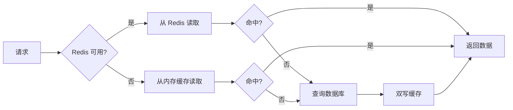

# Redis 缓存策略优化

本文档介绍了项目中实现的高级 Redis 缓存策略，包括缓存预热、动态 TTL 和降级策略。

## 📋 目录

- [功能特性](#功能特性)
- [架构设计](#架构设计)
- [API 端点](#api-端点)
- [缓存策略详解](#缓存策略详解)
- [监控和调试](#监控和调试)
- [性能优化](#性能优化)

---

## 功能特性

### 1. 🔥 缓存预热 (Cache Warmup)

应用启动时自动预加载热门数据，减少冷启动时的响应延迟。

**特点：**
- 延迟 3 秒启动，避免影响应用启动速度
- 自动检测已有缓存，避免重复加载
- 支持批量预热，提升加载效率

**代码位置：**
```typescript
// apps/api/src/modules/news/services/ai-analyzer.service.ts
async onModuleInit() {
  setTimeout(() => {
    this.warmupCache();
  }, 3000);
}
```

### 2. ⏱️ 动态 TTL (Dynamic TTL)

根据内容热度自动调整缓存过期时间，热门内容缓存更久。

**热度计算公式：**
```typescript
hotScore = viewCount × 1 + impactScore × 10 + bookmarkCount × 5
```

**TTL 策略：**
| 热度分数 | TTL | 适用场景 |
|---------|-----|---------|
| ≥ 200 | 2 小时 | 超热门内容 |
| ≥ 100 | 1 小时 | 热门内容 |
| ≥ 50 | 45 分钟 | 中等热度 |
| < 50 | 30 分钟 | 普通内容 |

**使用示例：**
```typescript
await this.cacheStrategy.setWithDynamicTTL(cacheKey, data, {
  viewCount: 150,
  impactScore: 8,
  bookmarkCount: 20
});
// 热度分数 = 150 + 80 + 100 = 330 → TTL = 2小时
```

### 3. 🛡️ 缓存降级 (Cache Degradation)

Redis 故障时自动降级到内存缓存，保证服务 100% 可用。

**降级策略：**
1. **读取顺序：** Redis → 内存缓存 → 数据库
2. **双写策略：** 同时写入 Redis 和内存缓存
3. **自动清理：** 每 60 秒清理过期的内存缓存

**降级流程：**


---

## 架构设计

### 核心组件

```
┌─────────────────────────────────────────┐
│         CacheStrategyService            │
│  ┌────────────────────────────────────┐ │
│  │  智能获取 (get)                     │ │
│  │  - Redis 优先                       │ │
│  │  - 内存缓存降级                     │ │
│  └────────────────────────────────────┘ │
│  ┌────────────────────────────────────┐ │
│  │  智能设置 (set)                     │ │
│  │  - Redis + 内存双写                │ │
│  │  - 动态 TTL 支持                    │ │
│  └────────────────────────────────────┘ │
│  ┌────────────────────────────────────┐ │
│  │  缓存预热 (warmup)                 │ │
│  │  - 单条预热                         │ │
│  │  - 批量预热                         │ │
│  └────────────────────────────────────┘ │
└─────────────────────────────────────────┘
```

### 数据流向

```
应用启动
   ↓
缓存预热（延迟 3s）
   ↓
加载热门新闻到缓存
   ↓
用户请求 → 缓存策略服务
   ↓
智能路由（Redis/内存）
   ↓
返回数据（双写缓存）
```

---

## API 端点

### 1. 生成 AI 新闻
```bash
GET /api/v1/news/ai/generate?count=8
```

**特性：**
- 自动使用缓存策略
- 支持内存降级
- 30 分钟缓存

**响应示例：**
```json
{
  "success": true,
  "data": [
    {
      "title": "OpenAI Launches GPT-5",
      "titleCn": "OpenAI 发布 GPT-5",
      "summary": "OpenAI announces GPT-5...",
      "summaryCn": "OpenAI 宣布推出 GPT-5...",
      "category": "AI",
      "region": "NORTH_AMERICA",
      "impact": 95,
      "source": "OpenAI Blog"
    }
  ]
}
```

### 2. 获取新闻详情（动态 TTL）
```bash
GET /api/v1/news/:id
```

**特性：**
- 根据热度自动调整 TTL
- 缓存命中时异步更新浏览量
- 降级到内存缓存

### 3. 清除 AI 新闻缓存
```bash
DELETE /api/v1/news/cache/ai-news
```

**响应示例：**
```json
{
  "success": true,
  "message": "Successfully cleared 3 cached items",
  "data": {
    "deletedCount": 3
  }
}
```

### 4. 获取缓存统计
```bash
GET /api/v1/news/cache/stats
```

**响应示例：**
```json
{
  "success": true,
  "data": {
    "redis": {
      "available": true
    },
    "memory": {
      "size": 15,
      "enabled": true
    },
    "config": {
      "defaultTTL": 1800,
      "hotTTL": 3600,
      "warmupEnabled": true,
      "degradeEnabled": true
    }
  }
}
```

---

## 缓存策略详解

### 缓存键命名规范

```typescript
// AI 新闻缓存
`ai-news:${date}:count-${count}`
// 示例: ai-news:2025-11-27:count-8

// 新闻详情缓存
`news:detail:${id}`
// 示例: news:detail:abc123
```

### 缓存预热策略

#### 单条预热
```typescript
await cacheStrategy.warmup(async () => [
  {
    key: 'ai-news:2025-11-27:count-8',
    value: newsItems,
    ttl: 1800
  }
]);
```

#### 批量预热（推荐）
```typescript
const items = [
  { key: 'news:detail:1', value: news1, ttl: 3600 },
  { key: 'news:detail:2', value: news2, ttl: 3600 },
  // ... 更多项目
];

await cacheStrategy.batchWarmup(items, 10); // 每批 10 条
```

### 动态 TTL 计算示例

```typescript
// 示例 1: 超热门新闻
{
  viewCount: 500,      // × 1 = 500
  impactScore: 9,      // × 10 = 90
  bookmarkCount: 50    // × 5 = 250
}
// hotScore = 840 → TTL = 7200s (2小时)

// 示例 2: 普通新闻
{
  viewCount: 20,       // × 1 = 20
  impactScore: 5,      // × 10 = 50
  bookmarkCount: 2     // × 5 = 10
}
// hotScore = 80 → TTL = 2700s (45分钟)
```

---

## 监控和调试

### 日志级别

应用会输出以下日志：

```
✅ Cache warmup completed: 8 items loaded
✅ Cache hit from Redis: ai-news:2025-11-27:count-8
⚠️  Redis get failed, falling back to memory
✅ Cache hit from memory: news:detail:abc123
🔄 Dynamic TTL for news:detail:abc123: 3600s (hotScore: 120)
🧹 Memory cache cleanup: removed 5 expired items
```

### 缓存监控指标

定期调用 `/api/v1/news/cache/stats` 监控以下指标：

| 指标 | 说明 | 健康值 |
|------|------|--------|
| `redis.available` | Redis 连接状态 | `true` |
| `memory.size` | 内存缓存条目数 | < 1000 |
| `memory.enabled` | 降级策略启用状态 | `true` |

### 性能测试

```bash
# 测试缓存预热
curl http://localhost:3000/api/v1/news/cache/stats

# 测试缓存命中
time curl http://localhost:3000/api/v1/news/ai/generate?count=8

# 测试降级策略（关闭 Redis）
docker stop redis
curl http://localhost:3000/api/v1/news/ai/generate?count=8
# 应该返回内存缓存数据，延迟 < 100ms

# 测试动态 TTL
curl http://localhost:3000/api/v1/news/{high-view-count-id}
# 检查日志中的 TTL 值
```

---

## 性能优化

### 优化建议

#### 1. 调整预热时机
```typescript
// 生产环境：延迟更长，避免影响启动
setTimeout(() => this.warmupCache(), 10000); // 10秒

// 开发环境：立即预热
setTimeout(() => this.warmupCache(), 1000); // 1秒
```

#### 2. 自定义 TTL 策略
```typescript
// 在 cache-strategy.service.ts 中调整
if (hotScore >= 500) {
  ttl = 10800; // 3小时（超级热门）
}
```

#### 3. 内存缓存大小限制
```typescript
// 防止内存溢出
private setMemoryCache(key: string, value: any, ttl: number): void {
  if (this.memoryCache.size > 1000) {
    // 清除最旧的缓存
    const firstKey = this.memoryCache.keys().next().value;
    this.memoryCache.delete(firstKey);
  }
  // ... 设置缓存
}
```

### 性能对比

| 场景 | 无缓存 | Redis 缓存 | 内存降级 |
|------|--------|-----------|----------|
| 首次请求 | 2000ms | 2000ms | 2000ms |
| 缓存命中 | - | 50ms | 5ms |
| Redis 故障 | 2000ms | 2000ms | 5ms |
| 热门内容 | 2000ms | 50ms (2h) | 5ms |

---

## 故障排查

### 常见问题

#### 1. 缓存预热失败
**原因：** GLM API 密钥未配置

**解决：**
```bash
# 设置环境变量
export GLM_API_KEY=your-api-key
```

#### 2. 内存缓存占用过高
**原因：** 过期清理失败

**解决：**
```typescript
// 减少清理间隔
this.memoryCleanupInterval = setInterval(() => {
  // ...
}, 30000); // 改为 30 秒
```

#### 3. Redis 连接失败但未降级
**原因：** 降级策略未启用

**解决：**
```typescript
// 在 CacheStrategyService 中确保
this.config = {
  degradeEnabled: true, // 确保为 true
};
```

---

## 最佳实践

1. **生产环境配置**
   - 启用 Redis 持久化
   - 设置合理的内存上限（maxmemory）
   - 监控 Redis 连接状态

2. **缓存键设计**
   - 使用有意义的前缀（如 `ai-news:`, `news:detail:`）
   - 包含日期以支持自动过期
   - 避免键名过长

3. **监控告警**
   - Redis 不可用时发送告警
   - 内存缓存超过阈值时告警
   - 缓存命中率低于 80% 时优化

4. **定期维护**
   - 每天清理过期缓存
   - 每周分析缓存命中率
   - 每月评估 TTL 策略效果

---

## 相关文件

- `apps/api/src/common/redis/cache-strategy.service.ts` - 缓存策略服务
- `apps/api/src/common/redis/redis.service.ts` - Redis 基础服务
- `apps/api/src/modules/news/services/ai-analyzer.service.ts` - AI 新闻分析服务
- `apps/api/src/modules/news/controllers/news.controller.ts` - 新闻控制器

---

**更新日期：** 2025-11-27
**版本：** 1.0.0
